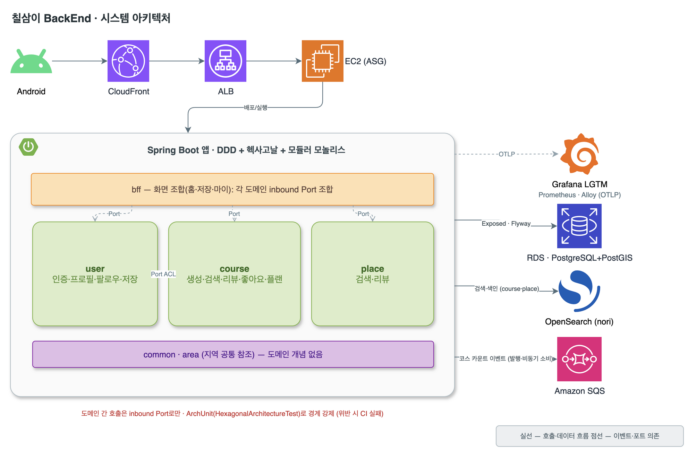
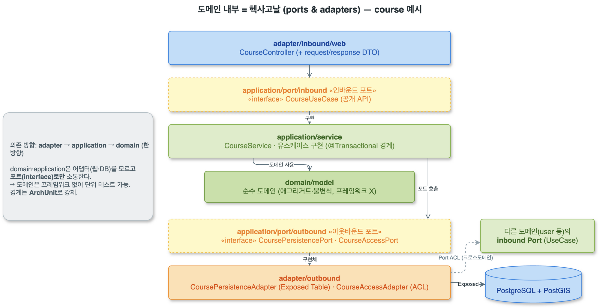

# 칠삼이 BackEnd

코스/장소 기반 로컬 큐레이션 서비스 **Courmy(칠삼이)** 의 API 서버. DDD + 헥사고날 모듈러 모놀리스로 구성한다.



## 1. 스택

- Kotlin 2.3.21 / JDK 21
- Spring Boot 4.1.0 (WebMVC, Security, Actuator, Validation)
- Exposed 1.3.0 (ORM) + Flyway (마이그레이션) + PostgreSQL + PostGIS / HikariCP
- OpenSearch (한국어 검색 색인 · nori 형태소 분석)
- Amazon SQS (코스 카운트 이벤트 비동기 집계)
- 모니터링: Micrometer + OTLP → LGTM stack · Prometheus · Grafana Alloy
- springdoc-openapi (Swagger UI, JWT Bearer)

## 2. 로컬 개발

```bash
# 1) 로컬 DB 기동 (PostgreSQL)
docker compose up -d

# 2) pre-commit 훅 설치 (최초 1회)
brew install pre-commit          # 또는 pip install pre-commit
pre-commit install               # commit-msg·pre-commit 훅 자동 설치

# 3) 실행 / 빌드 (멀티모듈 - 실행 산출물은 :bootstrap 모듈)
./gradlew :bootstrap:bootRun
./gradlew build jacocoTestReport        # 집계 커버리지 리포트: bootstrap/build/reports/jacoco/test/
```

> 모듈 구조(도메인/바운디드 컨텍스트 단위): `:common`, `:area`, `:media`, `:direction`, `:place`, `:course`, `:user`, `:mobile`, `:bootstrap`. 레이어(domain/application/adapter)는 각 모듈 내부 패키지로 유지하고, 크로스도메인 의존 방향을 모듈로 강제한다(상대 도메인의 inbound 포트만 참조는 ArchUnit). 실행 가능한 bootJar 는 `:bootstrap` 만 만든다.

- 애플리케이션: `http://localhost:8080`
- Swagger UI: `http://localhost:8080/swagger-ui.html`
- 헬스체크: `http://localhost:8080/actuator/health`

## 3. 컨벤션

### 3-1. 브랜치 전략 (gitflow)

```text
feat/* ─▶ develop ─▶ main
```

- `main`: 항상 배포 가능한 릴리스 브랜치. 보호됨, 직접 푸시 금지.
- `develop`: 통합 브랜치. 기능은 여기로 먼저 병합.
- 작업 브랜치: `<type>/<SCRUM-키>-<요약>` — 예) `feat/SCRUM-163-cd-refresh`
- `main` 직접 머지 금지 — 반드시 `develop`을 거친다.

### 3-2. 커밋 컨벤션 (Conventional Commits)

`<type>: 내용` — `type ∈ feat · docs · fix · chore · hotfix · release`

`pre-commit`의 commit-msg 훅(`--strict`)이 형식을 강제한다.

### 3-3. PR 규칙

- 제목: `SCRUM-<번호> <type>: 내용` — 앞에 Jira 키를 붙여 자동 연결.
- 템플릿(변경 요약 / 변경 유형 / 체크리스트)을 채운다.
- **CodeRabbit 리뷰를 확인·반영한 뒤 머지한다.**
- CI 필수 체크(§4-1) 통과 필수.

### 3-4. 릴리스 (SemVer)

- `develop → main` PR, 제목 `release: vX.Y.Z`.
- 머지 후 `main`에 `vX.Y.Z` 태그를 부여한다 (Semantic Versioning).
- `main` 병합 시 CD가 자동 배포한다 (아래 4-2).

### 3-5. 코드 컨벤션

- ktlint 규칙 준수 (`.editorconfig`, `no-wildcard-imports`, max line 120).
- 커밋 전 pre-commit이 ktlint 포맷을 검사한다.

## 4. CI/CD

### 4-1. CI (`ci.yml`) — `main`·`develop` 대상 PR

| 체크 | 내용 |
|---|---|
| ktlint | 포맷 검사 (ktlint 1.8.0) |
| build & test | 빌드 + 테스트 + JaCoCo 커버리지 |
| diff coverage | 변경분(diff) 라인 커버리지 게이트 (임계 90%) |
| architecture | ArchUnit 아키텍처 경계 규칙 (DB 불필요) |
| opensearch integration test | OpenSearch 실연결 통합테스트 (Testcontainers) |
| docker & trivy | 이미지 빌드 + 이미지 취약점 스캔 |
| code security | Trivy fs (secret·misconfig) + Semgrep(SAST) |
| CodeRabbit | AI 코드 리뷰 |

### 4-2. CD (`cd.yml`) — `main` push

1. 이미지 빌드 → ECR push (`:latest`, `:<sha>`)
2. ASG **instance refresh** 트리거 → 새 인스턴스가 `:latest`를 pull, ELB 헬스체크 통과 시 무중단 롤링 교체
   - `MinHealthyPercentage=50`, `InstanceWarmup=180`
   - 진행 중 refresh가 있으면 취소·대기 후 최신 이미지로 재시작

인프라(ECR·ASG·배포 IAM)는 [`swmaestro-732/Infra`](https://github.com/swmaestro-732/Infra) 레포에서 관리한다.

## 5. 아키텍처 (DDD + 헥사고날, 모듈러 모놀리스)

**멀티모듈은 쓰지 않고**, 도메인(bounded context)별로 패키지를 나눈 뒤 각 도메인 안을 헥사고날로 구성한다. 나중에 특정 도메인을 MSA로 떼기 쉽게(extraction-ready) 경계를 유지한다.

```text
com.example.backend
├─ bootstrap/                 # 조립 루트: 앱 진입점, config(Security/OpenAPI), 전역 예외핸들러
├─ common/                    # 도메인 무관 기술 공통(response/exception/geo 등). 도메인 개념 금지.
├─ user/                      # 도메인(= bounded context). 각 도메인 내부를 헥사고날로 구성.
│  ├─ domain/model/           # 순수 도메인 (Spring·Exposed 의존 X). 애그리거트·불변식.
│  ├─ application/
│  │  ├─ port/inbound/        # 유스케이스 계약 (UserUseCase)
│  │  ├─ port/outbound/       # 영속성 계약 (UserPersistencePort)
│  │  ├─ service/             # 유스케이스 구현 (트랜잭션 경계)
│  │  └─ dto/                 # Command/Result — 애플리케이션 경계 타입(도메인 비노출)
│  └─ adapter/
│     ├─ inbound/web/         # 컨트롤러 + request/·response/ DTO
│     └─ outbound/persistence/ # Exposed 테이블 + 포트 구현체(도메인↔행 매핑)
├─ place/                     # 도메인. 장소 검색(OpenSearch)·리뷰. 장소 리뷰 테이블도 이 도메인 persistence 에.
├─ course/                    # 도메인. 코스 생성·검색·리뷰·좋아요·플랜. 코스 리뷰 테이블도 이 도메인 persistence 에.
├─ area/                      # 지역 참조(여러 도메인이 공유)
├─ direction/                 # 도보 경로·시간 (TMAP 보행자 API)
├─ media/                     # 이미지 업로드용 S3 프리사인 URL 발급
└─ mobile/                    # 화면 조합(BFF): 여러 도메인의 inbound 포트를 조합하는 화면(홈/저장/마이/상세 등)만 모음
```

각 도메인 내부는 헥사고날(ports & adapters)로 구성한다 — 컨트롤러(inbound 어댑터)가 inbound 포트(UseCase)를 호출하고, 서비스가 이를 구현하며, 도메인 모델과 outbound 포트(PersistencePort·AccessPort)를 통해 어댑터·다른 도메인과 소통한다.



도메인은 user/place/course 3개이며 각 도메인 내부는 헥사고날로 구성한다.
리뷰는 별도 도메인이 아니라 대상 도메인에 속한다 — 장소 리뷰(place_reviews 등)는 `place`, 코스 리뷰(course_reviews 등)는 `course` 의 `adapter/outbound/persistence/` 에 둔다.
**BFF는 `mobile` 패키지 하나**에 모은다(하위는 `mobile/home`, `mobile/course` 등 화면 묶음) — 여러 도메인을 조합해야 하는 화면(홈·저장·마이 등)의 컨트롤러+조합서비스만 두고, 도메인의 `application.port.inbound`만 호출한다(테이블·도메인 로직 없음). 단일 도메인으로 끝나는 화면(지도=place 등)은 BFF가 아니라 해당 도메인에 둔다.
user/place/course 세 도메인과 mobile 모두 실제 기능이 구현돼 있으며, 같은 헥사고날 구조를 공유한다.
API 요청은 BFF를 거치지 않고 각 모듈의 컨트롤러로 바로 들어온다. `mobile`은 여러 도메인을 묶어야 하는 화면 API만 맡는다.
`area`(지역), `direction`(도보 경로), `media`(업로드)는 특정 도메인에 속하지 않는 보조 모듈로 따로 둔다.

도메인 간 연동 예: 코스 변경은 **SQS** 로 작성자 공개범위별 코스 수 집계를 비동기 처리하고, 코스·장소 변경은 **OpenSearch** 색인을 이벤트로 갱신한다. 좋아요/저장 등 카운터는 course 도메인이 소유하고 다른 도메인은 inbound Port(ACL)로만 갱신한다.

**의존 규칙** (adapter → application → domain 한 방향):
- 도메인·애플리케이션은 어댑터(웹·DB)를 모르고 포트(인터페이스)로만 소통 → 도메인은 프레임워크 없이 단위 테스트 가능(`UserTest`).
- **도메인 간 호출은 Port로만**: 한 도메인은 상대 도메인의 `application.port.inbound`(공개 API)만 참조하고, 조회는 `adapter/outbound/<도메인>`의 내부 어댑터가 상대 inbound 포트를 호출한다. 알림은 도메인 이벤트. MSA 확장 시 이 어댑터만 원격 호출로 교체.
- **BFF 예외**: `mobile`(홈·저장·마이 등 화면 조합)은 화면단위 조합을 위해 도메인의 inbound 포트에 의존할 수 있다.
- **DB 규율**: 크로스 도메인 FK·JOIN 금지, 트랜잭션 경계는 도메인 안에서만.

**경계 강제**: 위 규칙을 **ArchUnit 테스트**(`HexagonalArchitectureTest`)로 검증한다 — 위반 시 CI 실패. 크로스 도메인 격리·common→도메인 비참조 규칙 포함.

- `in`은 Kotlin 예약어라 하위 패키지는 `inbound`/`outbound`로 명명한다.
